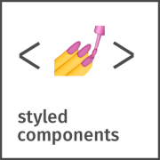

# Notas de carrinho

---
## About
"Notas de carrinho" it is an android/iOS mobile app written with __React Native__ that replaces your paper and supermarket list.

---

## [See the user interface](https://www.figma.com/file/WbECXPakw7ZHv7Hn5GMaJA/notas-de-carrinho?node-id=0%3A1)

---

## Build with

   
   
   
   
   

